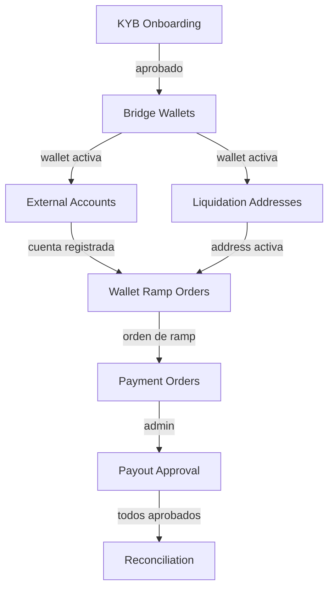

# Documento 07 — Nuevas Vistas y Funcionalidades

> **Propósito:** Definir las interfaces de usuario que el frontend actual NO tiene, pero que el backend ya soporta.  
> **Prerrequisito:** Fases 1-4 completadas  
> **Referencia técnica:** `06_endpoints_inventario.md` (129 endpoints verificados)

---

## 1. Resumen de Gaps Funcionales

El frontend actual (`m-guira`) soporta flujos básicos de onboarding KYC y órdenes de pago. Sin embargo, el backend `nest-base-backend` expone módulos avanzados que **no tienen representación en la UI**:

| Módulo | Endpoints Backend | Vistas Frontend Actuales | Gap |
|---|---|---|---|
| **KYB (Empresa)** | 9 endpoints | ❌ Ninguna | Completo |
| **Bridge Wallets** | 3 endpoints | ❌ Ninguna | Completo |
| **External Accounts** | 4 endpoints | ❌ Ninguna | Completo |
| **Liquidation Addresses** | 3 endpoints | ❌ Ninguna | Completo |
| **Bridge Payouts** | 2 endpoints | ❌ Ninguna | Completo |
| **Compliance (User)** | 5 endpoints | ❌ Solo estado | Parcial |
| **Wallet Ramp Flows** | 2 endpoints | ❌ Solo interbank | Parcial |
| **Admin: Bridge Payouts** | 3 endpoints | ❌ Ninguna | Completo |
| **Admin: Reconciliation** | 3 endpoints | ❌ Ninguna | Completo |
| **Admin: Transaction Limits** | 1 endpoint | ❌ Ninguna | Completo |
| **Admin: Audit Logs** | 2 endpoints | Vista básica | Parcial |

---

## 2. Nuevas Vistas de Usuario

### 2.1 Onboarding KYB (Empresa) — `/onboarding/business`

**Endpoints consumidos:**
- `POST /onboarding/kyb/business`
- `POST /onboarding/kyb/business/directors`
- `DELETE /onboarding/kyb/business/directors/:id`
- `POST /onboarding/kyb/business/ubos`
- `DELETE /onboarding/kyb/business/ubos/:id`
- `POST /onboarding/kyb/application`
- `PATCH /onboarding/kyb/application/submit`
- `GET /onboarding/kyb/tos-link`
- `POST /onboarding/kyb/tos-accept`

**Diseño de flujo (wizard multi-paso):**

```
Paso 1: Datos de Empresa
├── business_name, legal_name, registration_number
├── country_of_incorporation, business_type, industry
├── website (opcional)
└── Dirección completa (street, city, state, postal_code, country)

Paso 2: Directores
├── Lista de directores agregados
├── Formulario: first_name, last_name, date_of_birth, nationality, email, title
├── Botón "Agregar Director"
├── Acción "Eliminar" por director
└── Mínimo 1 director requerido

Paso 3: UBOs (Ultimate Beneficial Owners)
├── Lista de UBOs agregados
├── Formulario: first_name, last_name, date_of_birth, nationality, ownership_percentage
├── Validación: suma de ownership_percentage ≤ 100%
├── Botón "Agregar UBO"
└── Acción "Eliminar" por UBO

Paso 4: Documentos
├── Subida de documentos por subject_type: 'business', 'director', 'ubo'
├── Tipos: certificate_of_incorporation, articles_of_association, proof_of_address
├── Preview de documentos subidos con estado
└── subject_id dinámico según director/UBO seleccionado

Paso 5: Terms of Service Bridge
├── Obtener link de ToS con getKybTosLink()
├── Embed iframe o redirect externo
├── Confirmar aceptación con acceptKybTos()
└── Crear aplicación con createKybApplication()

Paso 6: Revisión y Envío
├── Resumen de toda la información
├── Validación client-side de campos obligatorios
├── Botón "Enviar para Revisión" → submitKyb()
└── Estado post-envío: "En revisión por nuestro equipo"
```

**Componentes necesarios:**
- `KybWizard` — Contenedor del wizard con stepper visual
- `BusinessInfoForm` — Formulario datos empresa
- `DirectorsManager` — Lista CRUD de directores
- `UboManager` — Lista CRUD de UBOs con validación de %
- `DocumentUploader` — Upload por subject reconfigurable
- `TosBridge` — Componente de aceptación ToS Bridge
- `KybReviewSummary` — Vista de resumen pre-envío

---

### 2.2 Wallet & Bridge Overview — `/wallet`

> **⚠️ Nota:** NO existen endpoints `/bridge/wallets`. Los wallets Bridge se crean internamente durante el onboarding. Los endpoints reales son del módulo **Wallets** (`/wallets/*`).

**Endpoints consumidos:**
- `GET /wallets` — Listar wallets activas
- `GET /wallets/balances` — Balances consolidados
- `GET /wallets/balances/:currency` — Balance por moneda
- `GET /wallets/payin-routes` — Rutas de depósito (virtual accounts)
- `GET /wallets/:id` — Detalle de wallet específica

**Interface:**

```
┌──────────────────────────────────────────┐
│ 💰 Mis Wallets                           │
│                                          │
│ ┌─────────────────────────────────────┐  │
│ │ USD Wallet          $1,234.56       │  │
│ │ Available: $1,000 · Reserved: $234  │  │
│ │ Provider: bridge · Chain: solana    │  │
│ │ [Ver Detalles] [Rutas de Depósito]  │  │
│ └─────────────────────────────────────┘  │
│                                          │
│ ┌─────────────────────────────────────┐  │
│ │ BOB Wallet          Bs. 8,500.00    │  │
│ │ Available: Bs. 8,500               │  │
│ │ Provider: internal                  │  │
│ └─────────────────────────────────────┘  │
│                                          │
│ ── Rutas de Depósito ────────────────── │
│ (from /wallets/payin-routes)            │
│ • Virtual Account USD: Chase ****4521  │
│ • PSAV BOB: QR + instrucciones         │
│ • Liquidation Address: 7xKXt...aB3f   │
└──────────────────────────────────────────┘
```

> **💡 Estrategia UX (Botón "Depositar"):** El botón "Depositar" existente en el frontend leerá directamente de `/wallets/payin-routes`. Si la cuenta es USD, mostrará una cuenta bancaria a su nombre (Virtual Account). Si es BOB, mostrará un QR PSAV.

---

### 2.3 External Accounts (Fusión con "Proveedores") — `/settings/external-accounts`

> **💡 Estrategia UX (Sección "Proveedores"):** Esta vista se integrará visualmente con el directorio de Proveedores existente. En la UI el cliente añade "un proveedor", pero el frontend llamará inteligentemente a `/suppliers` para envíos domésticos locales y a `/bridge/external-accounts` para pagos internacionales (ACH, Wire, SEPA, SPEI).

**Endpoints consumidos:**
- `GET /bridge/external-accounts`
- `POST /bridge/external-accounts`
- `DELETE /bridge/external-accounts/:id`
- `GET /bridge/external-accounts/:id`

**Interface:**

```
┌─────────────────────────────────────────────┐
│ 🏦 Cuentas de Destino Externas             │
│                                             │
│ ┌─────────────────────────────────────────┐ │
│ │ 🇺🇸 Chase Bank    ****4521   ACH       │ │
│ │    USD · Verificada                     │ │
│ │    [Eliminar]                           │ │
│ └─────────────────────────────────────────┘ │
│ ┌─────────────────────────────────────────┐ │
│ │ 🇲🇽 Banorte       ****7832   SPEI      │ │
│ │    MXN · Verificada                     │ │
│ │    [Eliminar]                           │ │
│ └─────────────────────────────────────────┘ │
│                                             │
│  [+ Agregar Cuenta]                        │
└─────────────────────────────────────────────┘
```

**Formulario dinámico por payment_rail:**

| Rail | Campos requeridos |
|---|---|
| `ach` | routing_number, account_number, account_type |
| `wire` | routing_number, account_number, swift_code, bank_name, address |
| `sepa` | iban, bic |
| `spei` | clabe, bank_name |
| `pix` | pix_key, tax_id, bank_code, branch_code, account_type |

**Componentes:**
- `ExternalAccountList` — Listado con badges de rail
- `CreateExternalAccountWizard` — Wizard con paso 1 (seleccionar rail) + paso 2 (campos dinámicos)
- `PaymentRailForm` — Componente genérico que renderiza campos según rail seleccionado

---

### 2.4 Liquidation Addresses (Crypto) — `/settings/liquidation-addresses`

**Endpoints consumidos:**
- `GET /bridge/liquidation-addresses`
- `POST /bridge/liquidation-addresses`
- `DELETE /bridge/liquidation-addresses/:id`

**Interface:**

```
┌──────────────────────────────────────────┐
│ 🔗 Direcciones de Liquidación            │
│                                          │
│ Recibe crypto en estas direcciones para  │
│ liquidación automática a USD.            │
│                                          │
│ ┌─────────────────────────────────────┐  │
│ │ Solana · USDC                       │  │
│ │ 7xKXt...aB3f                       │  │
│ │ [Copiar] [Eliminar]                │  │
│ └─────────────────────────────────────┘  │
│                                          │
│ ┌─────────────────────────────────────┐  │
│ │ Ethereum · USDC                     │  │
│ │ 0x3fa...8c2d                       │  │
│ │ [Copiar] [Eliminar]                │  │
│ └─────────────────────────────────────┘  │
│                                          │
│  [+ Crear Dirección]                    │
│  Chain: [Solana ▼]  Currency: [USDC ▼]  │
└──────────────────────────────────────────┘
```

**Componentes:**
- `LiquidationAddressList` — Lista con copy-to-clipboard
- `CreateLiquidationDialog` — Selector de chain + currency

---

### 2.5 Wallet Ramp Flows — Extensión de la vista "Enviar" (`/orders/new`)

> **💡 Estrategia UX (Botón "Enviar"):** El actual flujo de "Enviar" se convertirá en un orquestador inteligente. Al usuario indicar monto y destinatario, el UI llamará a `/payment-orders/interbank` si es destino local, o a `/payment-orders/wallet-ramp` si involucra Crypto o External Accounts internacionales.

**Endpoints consumidos:**
- `POST /payment-orders/wallet-ramp`
- `GET /payment-orders/wallet-ramp/:id`

**Cambio en UI:**

La pantalla actual de nueva orden solo soporta `interbank`. Se debe agregar un **selector de categoría** al inicio:

```
┌──────────────────────────────────────────┐
│ Nueva Orden de Pago                      │
│                                          │
│ ┌──────────────┐ ┌──────────────┐       │
│ │ 🏦 Interbank │ │ 💱 Wallet    │       │
│ │  (seleccionado)│ │   Ramp      │       │
│ └──────────────┘ └──────────────┘       │
│                                          │
│ Si "Wallet Ramp":                       │
│                                          │
│ Tipo de operación:                      │
│  ○ Fiat BO → Bridge Wallet             │
│  ○ Crypto → Bridge Wallet              │
│  ○ Fiat US → Bridge Wallet             │
│  ○ Bridge Wallet → Fiat BO             │
│  ○ Bridge Wallet → Crypto              │
│  ○ Bridge Wallet → Fiat US             │
│                                          │
│ Monto: [_________]                      │
│ Moneda: [USD ▼]                         │
│                                          │
│ Cuenta destino: [Seleccionar... ▼]      │
│ (Para ramps que requieren external_account) │
│                                          │
│ [Continuar]                             │
└──────────────────────────────────────────┘
```

**Componentes:**
- `FlowCategorySelector` — Toggle interbank / wallet_ramp
- `WalletRampFlowSelector` — Radio buttons con los 6 sub-flows
- `ExternalAccountPicker` — Dropdown de cuentas registradas
- `WalletRampOrderForm` — Formulario completo

---

### 2.6 Compliance Dashboard (User) — `/compliance`

**Endpoints consumidos:**
- `GET /compliance/kyc`
- `GET /compliance/kyb`
- `GET /compliance/reviews`
- `GET /compliance/documents`
- `POST /compliance/documents/upload-url`
- `POST /compliance/documents`

**Interface:**

```
┌──────────────────────────────────────────┐
│ 📋 Mi Compliance                         │
│                                          │
│ ┌─────────────────┐ ┌────────────────┐  │
│ │ KYC Personal    │ │ KYB Empresa    │  │
│ │ ✅ Aprobado     │ │ 🔄 En Revisión │  │
│ │ Desde: 15 Mar   │ │ Enviado: 1 Abr │  │
│ └─────────────────┘ └────────────────┘  │
│                                          │
│ ── Historial de Revisiones ───────────  │
│ ┌─────────────────────────────────────┐  │
│ │ #REV-034  KYC  ✅ Aprobado  15 Mar │  │
│ │ #REV-041  KYB  🔄 En revisión 1 Abr│  │
│ └─────────────────────────────────────┘  │
│                                          │
│ ── Mis Documentos ────────────────────  │
│ ┌─────────────────────────────────────┐  │
│ │ 📄 government_id.pdf  ✅ Aprobado  │  │
│ │ 📄 proof_address.jpg  ⏳ Pendiente │  │
│ │ [+ Subir Documento]                │  │
│ └─────────────────────────────────────┘  │
└──────────────────────────────────────────┘
```

**Componentes:**
- `ComplianceStatusCards` — Visual para KYC y KYB status
- `ReviewHistoryList` — Timeline de revisiones
- `ComplianceDocumentList` — Documentos con estado
- `ComplianceDocumentUpload` — Upload con URL firmada

---

## 3. Nuevas Vistas Admin

### 3.1 Bridge Payout Approval — `/admin/bridge-payouts`

**Endpoints consumidos:**
- `GET /admin/bridge/payouts` (listado)
- `POST /admin/bridge/payouts/:id/approve`
- `POST /admin/bridge/payouts/:id/reject`

**Interface:**

```
┌───────────────────────────────────────────────────┐
│ 💸 Payouts Pendientes de Aprobación               │
│                                                   │
│ ┌──────┬──────────┬────────┬────────┬───────────┐ │
│ │ ID   │ Usuario  │ Monto  │ Rail   │ Acciones  │ │
│ ├──────┼──────────┼────────┼────────┼───────────┤ │
│ │ #041 │ juan@... │ $5,000 │ ACH    │ ✅ ❌     │ │
│ │ #042 │ emp@...  │ $12K   │ WIRE   │ ✅ ❌     │ │
│ │ #043 │ user@... │ $850   │ SPEI   │ ✅ ❌     │ │
│ └──────┴──────────┴────────┴────────┴───────────┘ │
│                                                   │
│ Al rechazar: modal con campo "Razón de rechazo"  │
└───────────────────────────────────────────────────┘
```

**Componentes:**
- `PayoutApprovalTable` — Tabla con filtros y acciones inline
- `PayoutRejectModal` — Modal con textarea para razón

---

### 3.2 Reconciliation Dashboard — `/admin/reconciliation`

**Endpoints consumidos:**
- `POST /admin/reconciliation/run`
- `GET /admin/reconciliation`
- `GET /admin/reconciliation/:id`

**Interface:**

```
┌─────────────────────────────────────────────────┐
│ 🔍 Reconciliación Financiera                    │
│                                                 │
│ [▶ Ejecutar Reconciliación]  Última: hace 2h   │
│                                                 │
│ ── Historial ────────────────────────────────── │
│ ┌──────┬──────────┬──────────┬────────────────┐ │
│ │ ID   │ Estado   │ Checked  │ Discrepancias  │ │
│ ├──────┼──────────┼──────────┼────────────────┤ │
│ │ #12  │ ✅ OK    │ 1,245    │ 0              │ │
│ │ #11  │ ⚠️ Alert│ 1,200    │ 3              │ │
│ │ #10  │ ✅ OK    │ 1,180    │ 0              │ │
│ └──────┴──────────┴──────────┴────────────────┘ │
│                                                 │
│ [Ver Detalle #11] → Informe de discrepancias   │
└─────────────────────────────────────────────────┘
```

**Componentes:**
- `ReconciliationTrigger` — Botón con confirmación y loading
- `ReconciliationHistory` — Tabla con estado visual
- `ReconciliationDetail` — Informe detallado de discrepancias

---

### 3.3 Transaction Limits Manager — `/admin/users/:id/limits`

**Endpoint consumido:**
- `POST /admin/users/:id/limits`

**Ubicación:** Dentro de la vista de detalle de usuario admin existente.

**Interface:**

```
┌─────────────────────────────────────────┐
│ ⚙️ Límites de Transacción — Juan Pérez │
│                                         │
│ Límite diario:        [$10,000    ]     │
│ Límite mensual:       [$50,000    ]     │
│ Límite por transacción: [$5,000   ]     │
│ Moneda:               [USD ▼]           │
│                                         │
│ [Guardar Límites]                       │
│                                         │
│ Nota: Se aplicarán inmediatamente.      │
│ Se registra en audit log automáticamente.│
└─────────────────────────────────────────┘
```

**Componente:**
- `TransactionLimitsForm` — Inline form con save

---

### 3.4 Enhanced Audit Log Viewer — `/admin/audit-logs`

**Endpoints consumidos:**
- `GET /admin/audit-logs`
- `GET /admin/audit-logs/user/:userId`

**Mejoras sobre la vista básica existente:**

1. **Filtro por usuario** — Con autocomplete de perfiles
2. **Filtro por acción** — Dropdown con acciones conocidas
3. **Filtro por tabla** — Dropdown con tablas del sistema
4. **Vista de diff** — Expandir fila para ver `old_values` vs `new_values` en comparación lado a lado
5. **Exportar** — CSV/PDF de logs filtrados

**Componentes:**
- `AuditLogFilters` — Barra de filtros avanzados
- `AuditLogTable` — Tabla principal con expandable rows
- `AuditDiffViewer` — JSON diff visual (old → new)

---

## 4. Mapa de Rutas Nuevas (Next.js App Router)

```
app/
├── (user)/
│   ├── onboarding/
│   │   └── business/          🆕 KYB wizard
│   │       └── page.tsx
│   ├── wallet/
│   │   └── bridge/            🆕 Bridge wallets
│   │       └── page.tsx
│   ├── settings/
│   │   ├── external-accounts/ 🆕 Cuentas destino
│   │   │   └── page.tsx
│   │   └── liquidation-addresses/ 🆕 Crypto addresses
│   │       └── page.tsx
│   ├── compliance/            🆕 Mi compliance
│   │   └── page.tsx
│   └── orders/
│       └── new/               ✏️ Extender con wallet_ramp
│           └── page.tsx
│
├── (admin)/
│   ├── bridge-payouts/        🆕 Payout approval
│   │   └── page.tsx
│   ├── reconciliation/        🆕 Reconciliación
│   │   └── page.tsx
│   ├── users/
│   │   └── [id]/
│   │       └── limits/        🆕 Transaction limits (sub-page)
│   └── audit-logs/            ✏️ Mejorar con filtros y diffs
│       └── page.tsx
```

---

## 5. Componentes Compartidos Nuevos

| Componente | Uso | Descripción |
|---|---|---|
| `CopyButton` | External Accounts, Liquidation | Copiar texto al clipboard con feedback |
| `StatusBadge` | Múltiple | Badge visual con colores por status |
| `DiffViewer` | Audit Logs | Comparador visual JSON old→new |
| `WizardStepper` | KYB, External Accounts | Stepper horizontal para wizards |
| `FileUploader` | KYB, Compliance | Upload con drag-and-drop y preview |
| `PaymentRailIcon` | External Accounts, Payouts | Ícono por rail (ACH, SEPA, etc.) |
| `CurrencyDisplay` | Wallets, Orders | Formato moneda con símbolo y decimales |
| `EmptyState` | Todas las listas | Placeholder cuando no hay datos |
| `ConfirmDialog` | Acciones destructivas | Modal de confirmación con razón |

---

## 6. Dependencias de Datos entre Vistas



> **Nota:** Un usuario NO puede acceder a Bridge Wallets sin KYC/KYB aprobado. La UI debe validar `bridge_customer_id` en el perfil antes de permitir acceso a funcionalidades Bridge.

---

## 7. Guards y Validaciones de Acceso

| Vista | Condición de acceso | Fallback |
|---|---|---|
| Bridge Wallets | `profile.bridge_customer_id != null` | Redirect a /onboarding |
| External Accounts | Bridge wallet activa | Mensaje "Crea una wallet primero" |
| Liquidation Addresses | Bridge wallet activa | Mensaje "Crea una wallet primero" |
| Wallet Ramp Orders | External account o liquidation address | Mensaje "Registra una cuenta destino" |
| Admin Bridge Payouts | `role === 'admin' \|\| role === 'super_admin'` | 403 |
| Admin Reconciliation | `role === 'super_admin'` | 403 |
| Admin Transaction Limits | `role === 'admin' \|\| role === 'super_admin'` | 403 |

---

## 8. Checklist de Validación — Documento 07

| # | Vista | Criterio de aceptación |
|---|---|---|
| 1 | KYB Wizard | Flujo completo: datos → directores → UBOs → docs → ToS → submit |
| 2 | KYB Wizard | Error handling: campos faltantes, ownership > 100%, mín. 1 director |
| 3 | Bridge Wallets | Lista wallets, crear nueva, ver detalle con balance |
| 4 | External Accounts | Formulario dinámico por rail, crear, eliminar |
| 5 | Liquidation Addresses | Crear, listar, copiar dirección, eliminar |
| 6 | Wallet Ramp | 6 sub-flows renderizados, selección de cuenta destino |
| 7 | Compliance | KYC/KYB status cards, historial reviews, documentos |
| 8 | Bridge Payouts Admin | Lista pendientes, aprobar, rechazar con razón |
| 9 | Reconciliation Admin | Ejecutar, historial, detalle discrepancias |
| 10 | Transaction Limits | Form inline, guardar, validación |
| 11 | Audit Logs | Filtros avanzados, diff viewer, paginación |
| 12 | Guards | bridge_customer_id check, role check, redirects correctos |
